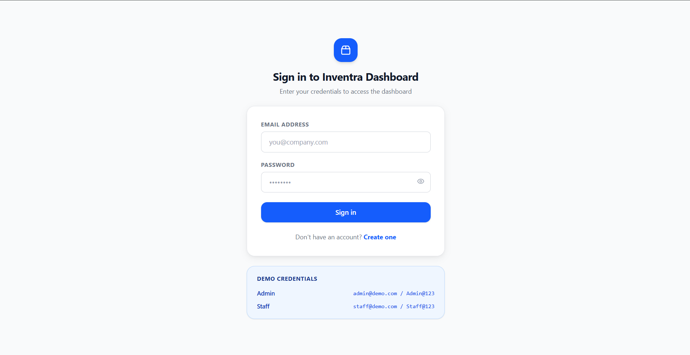
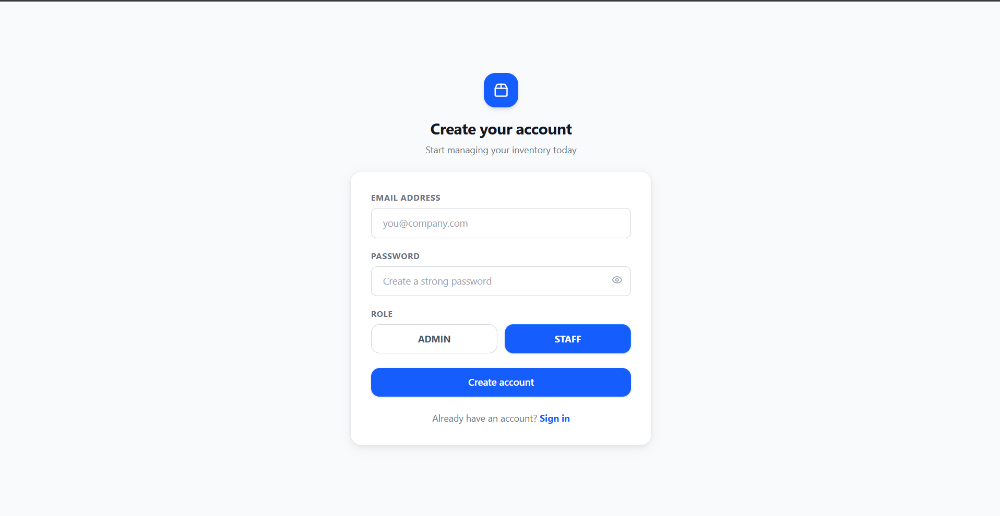
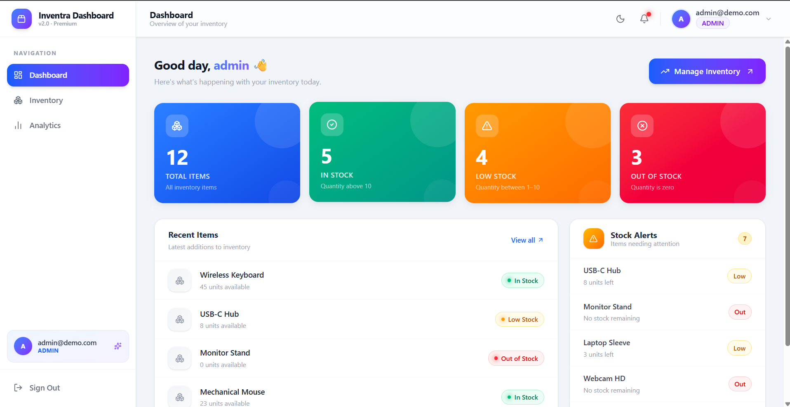
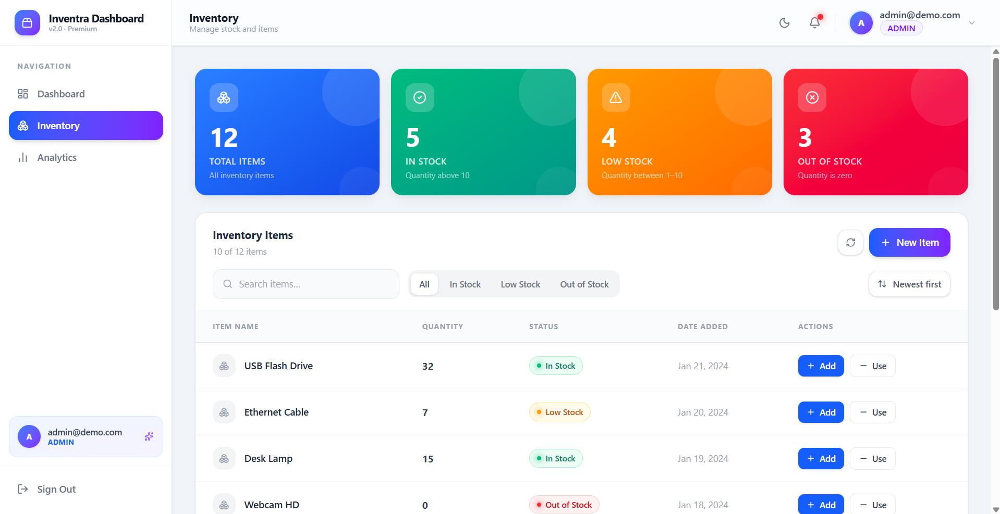
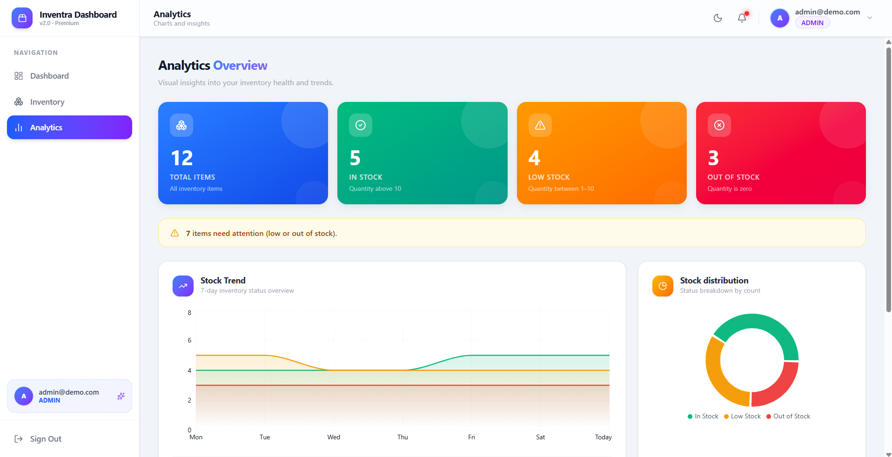

# Inventra Dashboard

A scalable Inventory Management Dashboard with authentication, role-based access control, and analytics. Built using React and TypeScript, this project demonstrates clean architecture, structured state management, and production-level UI/UX practices.


## Overview

Inventra Dashboard enables users to manage inventory efficiently with controlled access based on roles (Admin / Staff). It combines authentication, inventory operations, and analytics into a responsive and intuitive interface.


## Features

### Authentication & Authorization

* User registration with role selection (Admin / Staff)
* Login with mock JWT authentication
* Role-based access control (RBAC)
* Session persistence using localStorage


### Inventory Management

* Create and manage inventory items (Admin only)
* Stock adjustments (Add / Remove units)
* Optimistic UI updates
* Search and pagination support


### Dashboard

* Overview of inventory status:

  * In Stock (>10)
  * Low Stock (1–10)
  * Out of Stock (0)

* Aggregated metrics:

  * Total Items
  * In Stock
  * Low Stock
  * Out of Stock


### Analytics

* Total stock units across inventory
* Stock distribution visualization
* Trend analysis
* Top stocked items
* Insights for low/out-of-stock items


### User Experience

* Fully responsive design (mobile and desktop)
* Clean and consistent layout
* Toast notifications
* Loading states and skeleton screens
* Confirmation dialogs
* Empty state handling


## Tech Stack

* Frontend: React (TypeScript)
* Styling: Tailwind CSS
* State Management: Context API
* API Layer: Axios with Mock Adapter
* Data Visualization: Recharts
* Authentication: Mock JWT


## Getting Started

### Clone the repository

```bash
git clone https://github.com/Arpeeta-Mohanty/inventra-dashboard.git
cd inventra-dashboard
```

### Install dependencies

```bash
npm install
```

### Run the application

```bash
npm run dev
```

### Access locally

http://localhost:5173


## Demo Credentials

| Role  | Email                                   | Password  |
| ----- | --------------------------------------- | --------- |
| Admin | [admin@demo.com](mailto:admin@demo.com) | Admin@123 |
| Staff | [staff@demo.com](mailto:staff@demo.com) | Staff@123 |


## API Notes

This project uses a mock backend implemented via Axios Mock Adapter.

Simulated endpoints:

* POST /auth/register
* POST /auth/login
* GET /inventory/items
* POST /inventory/items
* POST /inventory/items/{id}/stock-in
* POST /inventory/items/{id}/stock-out

No external backend setup is required.


## Architecture

* Centralized state management using Context API
* Separation of concerns with a dedicated API layer
* Modular and reusable component structure
* Consistent data flow across Dashboard, Inventory, and Analytics


## Edge Cases Handled

* Invalid authentication attempts
* Duplicate user registration
* Unauthorized access restrictions
* Token persistence and expiration handling
* Empty inventory states
* Insufficient stock validation
* API error handling


## Key Highlights

* Role-based access control (Admin vs Staff)
* Optimistic UI updates for improved user experience
* Modular and reusable components
* Real-time inventory insights with analytics


## Screenshots

### Authentication

#### Sign In



#### Create Account




### Dashboard




### Inventory




### Analytics




## Demo Video

Add your demo video link (maximum 3 minutes):

https://your-demo-video-link.com


## Live Demo

Currently not deployed. Please run locally using the steps above.


## Assignment Coverage

This project fulfills the requirements of the Authentication and Inventory Management Dashboard assignment, including:

* Authentication workflows
* Inventory operations and stock management
* Role-based UI behavior
* State management and API abstraction
* Responsive and user-focused interface


## License

MIT License


## Author

Arpeeta Mohanty
https://github.com/Arpeeta-Mohanty


## Summary

Inventra Dashboard demonstrates a structured approach to frontend development by combining authentication, inventory management, and analytics into a cohesive and scalable application.
